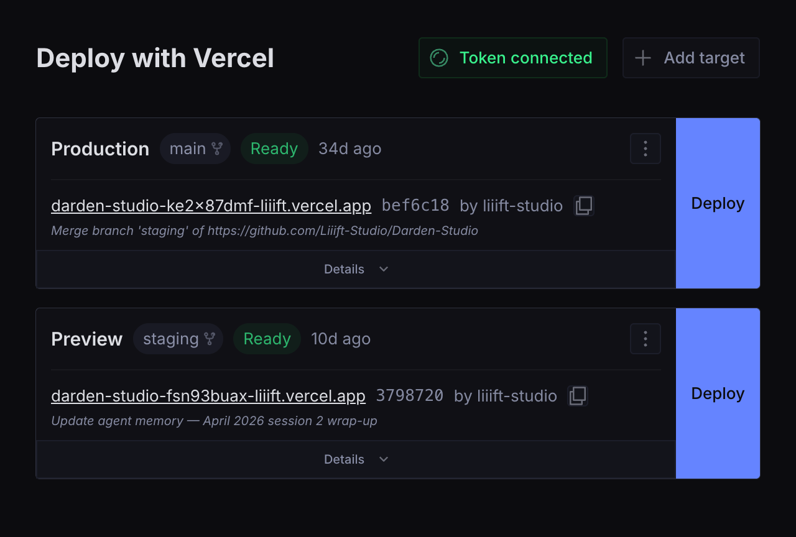

# deploy-vercel-from-sanity

**Trigger and monitor Vercel deployments directly from [Sanity Studio](https://www.sanity.io) — no context switching required.**

[](https://www.npmjs.com/package/@liiift-studio/deploy-vercel-from-sanity)
[](https://www.sanity.io)
[](./LICENSE)



---

## Features

- **One-click deploy** — trigger Production or Preview builds from inside Sanity Studio
- **Live status** with automatic polling — Queued → Building → Ready / Error
- **Build timer** showing elapsed time while a deploy is in progress
- **Cancel** in-progress deployments
- **Deploy-complete notifications** — Studio toast when a build finishes, errors, or is canceled
- **Copy deployment URL** with one click
- **GitHub commit links** — commit SHA links directly to the GitHub commit when repo metadata is available
- **Inline error log viewer** — see build errors without leaving the studio
- **Deployment history** per target
- **"Open in Vercel"** link to your project dashboard
- **Multiple targets** — configure Production, Preview, and any number of custom environments
- **Shared API token** — set it once; all authenticated studio users with editor access or above can deploy
- **Responsive grid layout** — 2 columns on desktop, 1 on mobile

---

## Installation

```bash
npm install @liiift-studio/deploy-vercel-from-sanity
```

---

## Quick start

### 1. Add the plugin to your Sanity config

```ts
// sanity.config.ts
import { defineConfig } from 'sanity'
import { vercelDeploy } from '@liiift-studio/deploy-vercel-from-sanity'

export default defineConfig({
  // ...
  plugins: [
    vercelDeploy({ title: 'Deploy', name: 'vercel-deploy' }),
  ],
})
```

### 2. Connect your Vercel API token

Open the **Deploy** tab in Sanity Studio and enter a Vercel API token when prompted.

To create a token: **vercel.com → Settings → Tokens → Create → Full Account scope**.

The token is stored in a `config.vercelDeploy` document in your dataset and shared across all authenticated studio users.

### 3. Add a deploy target

Create one or more `vercel_deploy` documents — each represents an environment (Production, Preview, etc.).

**Via Sanity CLI:**

```bash
sanity documents create << 'EOF'
{
  "_type": "vercel_deploy",
  "_id": "vercel-deploy-production",
  "name": "Production",
  "url": "https://api.vercel.com/v1/integrations/deploy/YOUR_PROJECT_ID/YOUR_HOOK_ID"
}
EOF
```

**To get your deploy hook URL:** Vercel Dashboard → Project → Settings → Git → Deploy Hooks → Create Hook.

**Available fields on each `vercel_deploy` document:**

| Field | Type | Required | Description |
|---|---|---|---|
| `name` | `string` | ✓ | Display label (e.g. "Production", "Preview") |
| `url` | `url` | ✓ | Vercel deploy hook URL |
| `teamId` | `string` | | Vercel team ID — required for team-owned projects |
| `disableDeleteAction` | `boolean` | | Hides the delete button for this target in the studio UI |

---

## Plugin options

| Option | Type | Default | Description |
|---|---|---|---|
| `name` | `string` | `'vercel-deploy'` | Tool slug in the Studio sidebar |
| `title` | `string` | `'Deploy'` | Tool label in the Studio sidebar |
| `icon` | `ComponentType` | `RocketIcon` | Custom sidebar icon |

---

## Restrict access to editors and above

By default the Deploy tab is visible to all authenticated users. To hide it from viewers:

```ts
// sanity.config.ts
tools: (prev, { currentUser }) => {
  const canDeploy = currentUser?.roles?.some(r =>
    ['administrator', 'editor'].includes(r.name)
  )
  return canDeploy ? prev : prev.filter(t => t.name !== 'vercel-deploy')
},
```

---

## How it works

1. Deploy targets are stored as `vercel_deploy` documents in your Sanity dataset.
2. The plugin fetches the last 10 deployments for each target from the Vercel API, filtered to those triggered by that hook.
3. While a deployment is active (Queued / Initializing / Building), it polls every 5 seconds.
4. Clicking **Deploy** POSTs to the hook URL — Vercel queues a new build.
5. If a deploy fails, clicking **Show error details** fetches the last 30 build log lines from the Vercel API inline.
6. A Studio toast notification fires when a deployment completes (Ready, Error, or Canceled).

> **Polling and rate limits** — Active deployments are polled every 5 seconds per target. With many simultaneous active deploys, API call volume adds up. Vercel's rate limit is generous for normal use, but studios with a large number of targets triggering concurrently may hit `429` errors. The plugin surfaces these with a clear message.

---

## Troubleshooting

### "Token is invalid or expired"

Your Vercel API token has been revoked or expired. Go to **Vercel → Settings → Tokens**, create a new token with **Full Account** scope, and reconnect it in the Deploy tab (top-right → *Token connected* button).

### "Token lacks the required permissions"

The token exists but was created with insufficient scope. Vercel tokens need **Full Account** scope to read deployments. Delete the token and create a new one with the correct scope.

### "Resource not found — check the deploy hook URL and team ID"

Either the deploy hook URL is incorrect, or the project belongs to a Vercel team and the **Team ID** field is missing from the deploy target. Find your Team ID at **Vercel → Settings → General → Team ID** (starts with `team_`) and add it to the deploy target via the edit menu.

### "Rate limit reached"

The plugin is making too many API calls at once (common when many targets are all actively building). Wait a few seconds — polling will resume automatically.

### Deploy triggers but status never updates

This usually means the token is missing. The plugin can trigger deploys via hook URL without a token, but it needs an API token to read back deployment status. Connect a token using the button in the top-right of the Deploy tab.

### Commit SHA does not link to GitHub

The SHA link requires Vercel to return GitHub repo metadata with the deployment. This is present on deployments triggered by GitHub pushes but not on manually triggered hook deploys. Manually triggered deploys will show the SHA as plain text with a tooltip.

### No error logs shown after a failed build

If "No stderr or stdout was captured" appears, the build may have failed before producing log output, or the events API returned no lines. Use **Open in Vercel** to view the full build log in the Vercel dashboard.

---

## Security

**API token storage** — The Vercel API token is stored in a `config.vercelDeploy` Sanity document, readable by all authenticated studio users. Audit who has access to your Sanity project at sanity.io → Project → Members. If your studio includes untrusted editors, consider a server-side proxy that holds the token and exposes only a scoped deploy endpoint.

**Deploy hook URL validation** — `triggerDeploy` validates that the hook URL matches `api.vercel.com/v1/integrations/deploy/` before making the request, preventing SSRF from a tampered document.

**External links** — All external links use `target="_blank" rel="noreferrer"` and are validated through `safeHref()` before rendering, blocking `javascript:` injection from a compromised API response.

**GROQ queries** — All GROQ queries in this plugin are static strings — no user input is interpolated.

---

## Requirements

- Sanity Studio v3, v4, or v5
- React 18 or 19
- A Vercel account with at least one project and a deploy hook configured

---

## Contributing

Issues and pull requests welcome at [github.com/Liiift-Studio/Deploy-Vercel-from-Sanity](https://github.com/Liiift-Studio/Deploy-Vercel-from-Sanity).

---

## License

MIT
